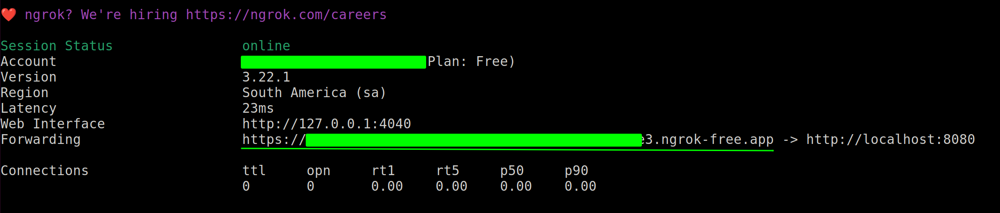
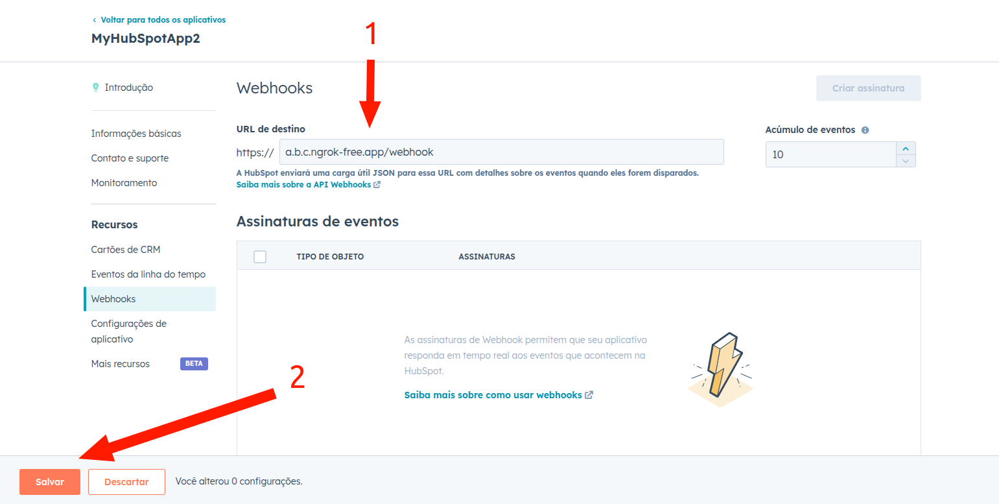

# hubspot-integration-api


## Prerequisites

- Ngrok (https://ngrok.com/docs/getting-started/)
- Docker
- Docker compose 2

## Run

1. Adicionar ```CLIENT_ID``` e ```CLIENT_SECRET``` fornecidos pelo hubspot ao application.yml 
2. Executar a aplicação:
```
$ docker compose up -d
```

Access:
http://localhost:8080/swagger-ui/index.html

3. Usar ngrok para registar webhook para o localhost
```ngrok http http://localhost:8080```


4. Copiar fowarding url e adicionar a assinatura do hubspot
Exemplo: ```a.b.c.ngrok-free.app/webhook```


## Using
- Clean Arquitecture
- Docker/Docker compose
- Tests (UnitTests)