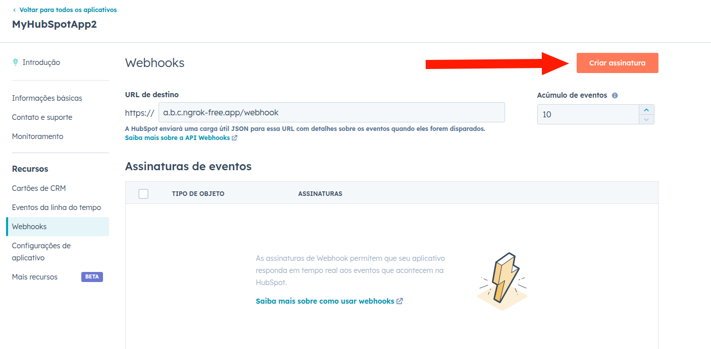
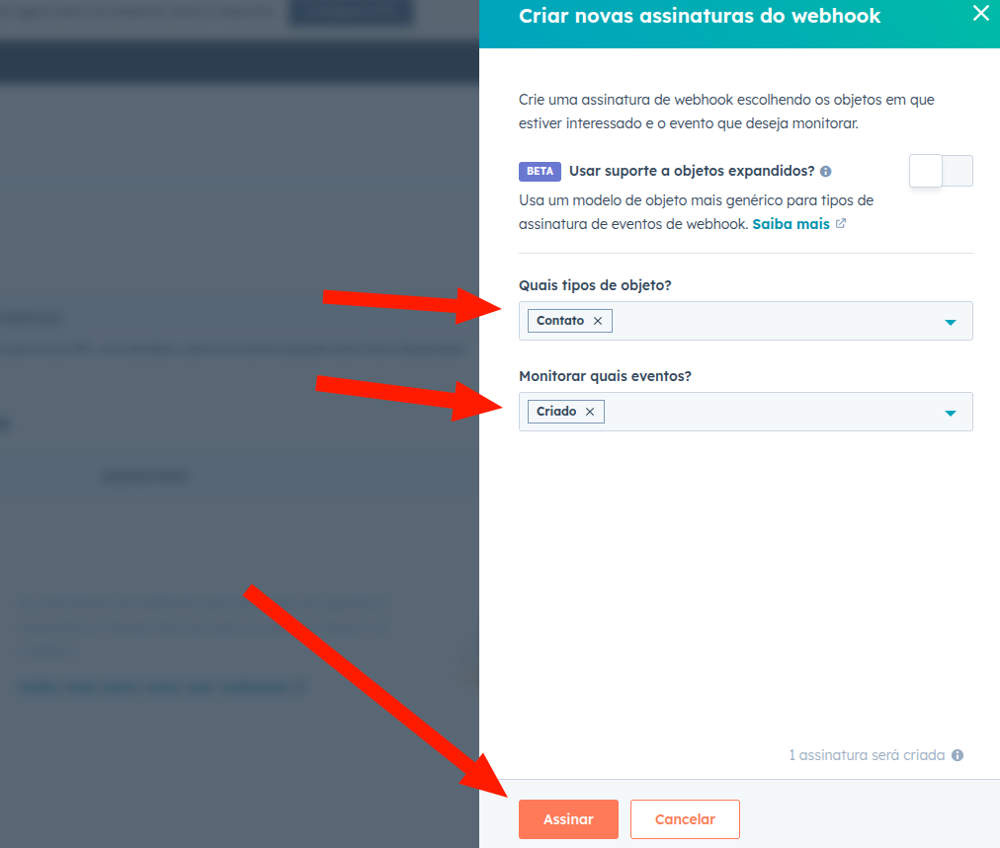
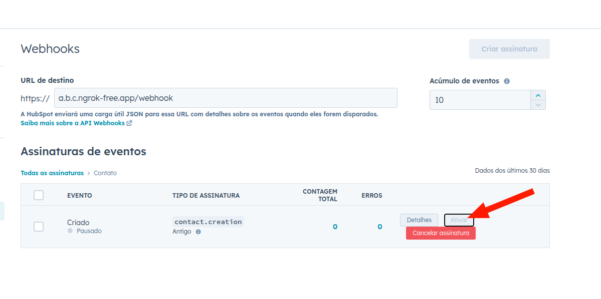

<h1 align="center">
  HubSpot Integration Api
</h1>

<div align="center">


</div>

## Prerequisites

- Ngrok (https://ngrok.com/docs/getting-started/)
- Docker
- Docker compose 2

## Run

#### 1. Adicionar ```CLIENT_ID``` e ```CLIENT_SECRET``` fornecidos pelo hubspot ao ```application-local.yml``` 

#### 2. Subir a aplicação:

```
docker compose up -d
```

#### 3. Usar ngrok para registar webhook para o localhost

```
ngrok http http://localhost:8080
```


#### 4. Copiar fowarding url e registrar o webhook no hubspot

Exemplo: ```a.b.c.ngrok-free.app/webhook```


#### 5. Criar assinatura para o objeto ```Contato``` e evento ```Criado``` no hubspot





#### 6. Gerar URL de autorização

http://localhost:8080/oauth/authorize

#### 7. Acessar swagger para salvar contatos

Iniciar fluxo oauth:

http://localhost:8080/oauth/authorize

OU

Via swagger
http://localhost:8080/swagger-ui/index.html

## Using
- Clean Arquitecture
- Docker/Docker compose
- Tests (UnitTests)